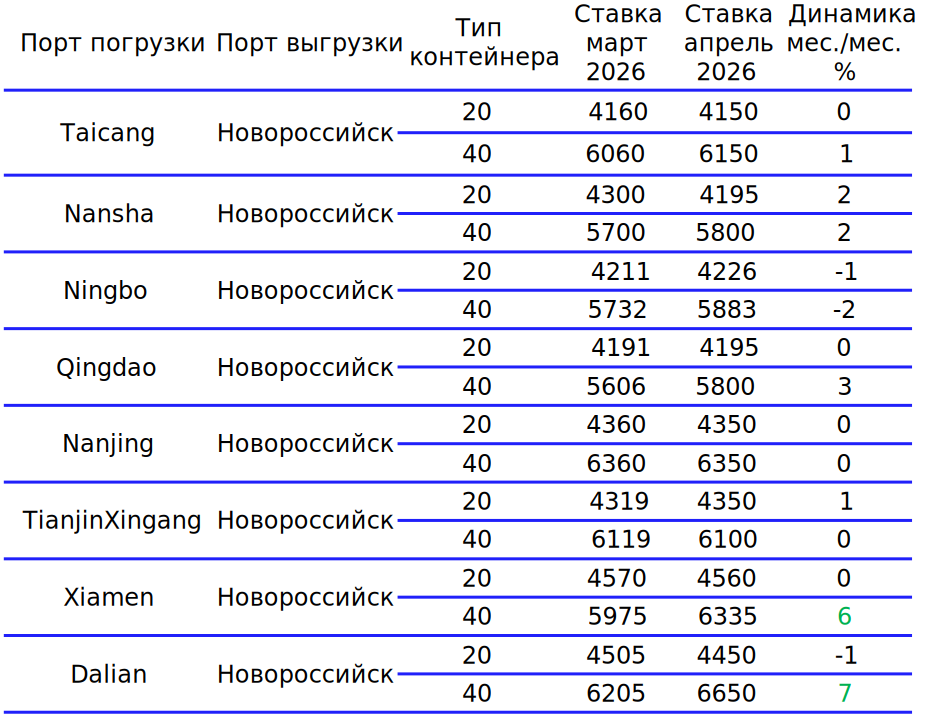

#  Морская логистика. Контейнеры {.my-custom-class style="margin-left:3%;"}

[Демоподписка](../demo-subscription.qmd)

:::::: {.grid style="margin-left:0%"}
::: {.g-col-12 .g-col-sm-12 .g-col-xs-12 .g-col-xl-6 .g-col-md-6 .g-col-lg-6}
### Котировки

*19.03.2026*

**Конфликт на Ближнем Востоке отбросил фрахт на 3 года назад**

-   На фоне конфликта на Ближнем Востоке морские линии начали вводить дополнительные надбавки к фрахту, уровень которого достиг трехлетнего максимума.
-   Объемы перевалки контейнеров в портах России выросли на 4,2% м/м, практически повторив результат прошлого года, в первую очередь благодаря Дальневосточному бассейну.
-   Недоступность порта Джабаль-Али (Дубай, ОАЭ) вынуждает рынок искать новые логистические схемы доставки контейнеров.

{width="6%"} [Подробнее](../demo-subscription.qmd)

*17.02.2026*

**Февраль заморозил моря и ставки**

-   По итогам 2026 г. объем перевалки контейнеров в российских портах сократился на 16,4% м/м (-13,4% г/г), что стало трехлетним январским минимумом.
-   На фоне относительно позднего празднования Китайского Нового года ставки на импортные перевозки из Китая оставались низковолатильными, сумев сохранить уровень января.
-   Постановление Правительства РФ №1828, вступающее в силу с 1 марта 2026 г., расширяет обязанности экспедитора, вменяя компаниям-организаторам перевозок контролирующие функции.

{width="6%"} [Подробнее](../demo-subscription.qmd)

*20.01.2026*

**Мажорная кода в минорной симфонии**

-   По итогам 2025 г. российские порты обработали на 4% меньше контейнеров г/г. Основное падение пришлось на Дальневосточный бассейн - основной для торговли с Китаем. Ситуацию сгладили результаты декабря, которые для большинства портов были выше среднегодовых.
-   На фоне предпраздничного ажиотажа импортные ставки фрахта выросли на большинстве направлений, достигнув максимальных за полгода значений, но уже фиксируемая коррекция цен в Новороссийске сигнализирует о краткосрочности этого импульса.
-   На фоне рекордного по вместимости и количеству судов флота мировые линии запланировали возвращение на традиционный маршрут через Суэцкий канал, что снижает перспективу роста фрахта.

{width="6%"} [Подробнее](../demo-subscription.qmd)
:::

::: {.g-col-12 .g-col-sm-12 .g-col-xs-12 .g-col-xl-6 .g-col-md-6 .g-col-lg-6}

### События

*7 февраля 2025. Пятница с Центром ценовых индексов. Логистика*

[Материалы →](../events/2025-02-07-logistics.qmd)
:::

::: {.g-col-12 .g-col-sm-12 .g-col-xs-12 .g-col-xl-6 .g-col-md-6 .g-col-lg-6}
### Методология

[Методология ценовых индикаторов](../methodology/methodology-benchmark-pbc.qmd)

[Спецификация ставок морского фрахта](../methodology/specs-freight.qmd)
:::
::::::
