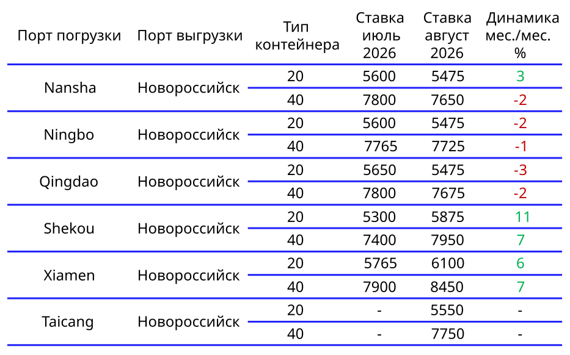

#  Морская логистика. Контейнеры {.my-custom-class style="margin-left:3%;"}

[Демоподписка](../demo-subscription.qmd)

:::::: {.grid style="margin-left:0%"}
::: {.g-col-12 .g-col-sm-12 .g-col-xs-12 .g-col-xl-6 .g-col-md-6 .g-col-lg-6}
### Котировки

*15.07.2026*

**Российские ставки фрахта попали в идеальный шторм**

-   Ожидание роста таможенных тарифов в США дополнительно стимулировало спрос на контейнерные перевозки и вывело мировой фрахт на максимумы за два года.
-   Комбинация нескольких факторов резко увеличила стоимость российской контейнерной логистики Азии до полуторагодового пика.
-   Оборот контейнерных портов России в июне достиг второго по величине уровня за последние 4,5 года.

{width="6%"} [Подробнее](../demo-subscription.qmd)

*15.06.2026*

**Море подорожало в сезон отпусков**

-   Мировые цены на контейнерные перевозки резко взлетели на фоне сезонного спроса.
-   Объемы перевалки контейнеров на Балтике и в АЧБ снизились, но рост показателей в Дальневосточном бассейне частично компенсировал падение.
-   Но фоне отложенного спроса, снижения пропускной способности и роста цен на железнодорожную логистику фрахт из Китая в Россию вырос.
-   Перевозчики уводят флот с маршрутов в Латинскую Америку на Ближний Восток.

{width="6%"} [Подробнее](../demo-subscription.qmd)

*15.05.2026*

**Фрахт между бункерным молотом и железнодорожной наковальней**

-   На фоне ухода части грузопотока на железнодорожный транспорт морские перевозчики вынуждены удерживать ставки, несмотря на рост эксплуатационных расходов.
-   Показатели перевалки контейнеров в апреле стали вторыми по размеру начиная с 2022 г.
-   Обсуждаемый ранее запрет на допуск к работе в российских портах иностранным морским линиям может быть смягчен. Отсутствие регистрации в Гослоге создает дополнительный налоговый риск, несмотря на частичные послабления от Министерства Транспорта РФ.

{width="6%"} [Подробнее](../demo-subscription.qmd)
:::

::: {.g-col-12 .g-col-sm-12 .g-col-xs-12 .g-col-xl-6 .g-col-md-6 .g-col-lg-6}

### События

*7 февраля 2025. Пятница с Центром ценовых индексов. Логистика*

[Материалы →](../events/2025-02-07-logistics.qmd)
:::

::: {.g-col-12 .g-col-sm-12 .g-col-xs-12 .g-col-xl-6 .g-col-md-6 .g-col-lg-6}
### Методология

[Методология ценовых индикаторов](../methodology/methodology-benchmark-pbc.qmd)

[Спецификация ставок морского фрахта](../methodology/specs-freight.qmd)
:::
::::::
