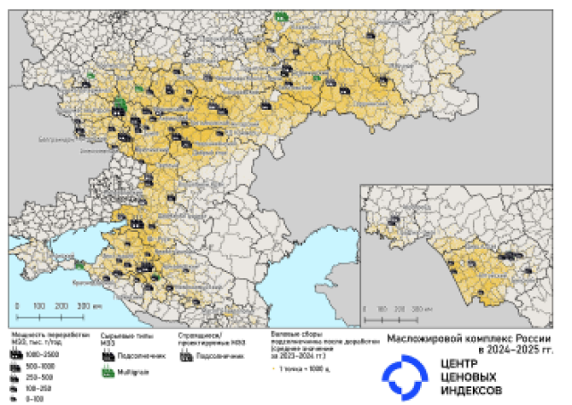

#  Подсолнечное масло {.my-custom-class style="margin-left:3%;"}

[Демоподписка](../demo-subscription.qmd)

::::: {.grid style="margin-left:0%"}
::: {.g-col-12 .g-col-sm-12 .g-col-xs-12 .g-col-xl-6 .g-col-md-6 .g-col-lg-6}
### Котировки

*03.03.2026 Подсолнечное масло*

**Цены на соевое масло рванули вверх**

Экспортные цены на подсолнечное масло за месяц выросли еще на 25 долл.

Соевое масло к началу марта 2026 г. выросло почти на 209 долл., премия к подсолнечному составила 50 долл. 

Согласно итоговым данным Росстата валовой сбор подсолнечника в России в 2025 г. вырос на 3,6% до 17,5 млн т.

{width="6%"} [Подробнее](../demo-subscription.qmd)

*03.02.2026 Подсолнечное масло*

**Россия стала нетто-экспортером сои**

Экспортные цены на подсолнечное масло за месяц выросли еще на 30 долл.

Россия в 2025 г. впервые в истории стала нетто-экспортером сои.

Индия в январе 2026 г. снизила импорт подсолнечного масла на 23% до 269 тыс. т.

{width="6%"} [Подробнее](../demo-subscription.qmd)

:::

::: {.g-col-12 .g-col-sm-12 .g-col-xs-12 .g-col-xl-6 .g-col-md-6 .g-col-lg-6}
#### Премия/дисконт пальмового масла к подсолнечному, долл.

```{r,warning = FALSE, echo = FALSE, message = FALSE}

library(highcharter)
library(openxlsx)
library(tidyr)

# df <- read.xlsx(xlsxFile = '../xls/график_подсолнечное масло.xlsx', sheet = 1) 
# names(df) = c('date', 'value')
# df$date <- as.Date(df$date, origin = "1899-12-30")

df <- read.xlsx(xlsxFile = '../data/Исходные данные.xlsx', sheet = "Рынки", detectDates = TRUE)
id = "Премия/дисконт пальмового масла к подсолнечному"
df = df[df$Наименование.показателя == id,]
df$Данные <- round(df$Данные,1)


hc = highchart() %>%
   hc_add_series(df, type = "column", hcaes(x = Дата, y = Данные), color = c("#1A4AFC"), 
                 name = "Премия/дисконт пальмового масла к подсолнечному, долл.") %>%
   hc_xAxis(type = 'datetime') %>% 
   hc_yAxis(title  = list(text = 'долл./т')) %>%
   hc_exporting(enabled = FALSE) %>%
   hc_tooltip(enabled  = TRUE)

# поменять названия месяцев на русские. по умолчанию - на английском
hc$x$conf_opts$lang$months = c("Январь"	,"Февраль",	"Март"	,"Апрель"	,"Май",	"Июнь", "Июль",	"Август",	"Сентябрь",	"Октябрь",	"Ноябрь",	"Декабрь")
hc$x$conf_opts$lang$shortMonths = c("Янв", 	"Фев",	"Мар",	"Апр",	"Май",	"Июн",	"Июл",	"Авг",	"Сен",	"Окт",	"Ноя",	"Дек")

hc

```

[*Примечание: премия/дисконт рассчитывается как разница спотовой цены на пальмовое масло на Малайзийской бирже (BURSA Malaysia) и экспортного индекса подсолнечного масла ЦЦИ (Russian Sunflower Oil FOB Black Sea). Источник — ежемесячные отчеты ЦЦИ «Подсолнечное масло»*]{style="font-size:0.75em"}

### Масложировой комплекс России в 2024-2025 гг. (подсолнечник)

<a href="../pdf/%D0%A6%D0%A6%D0%98%20%D0%9A%D0%B0%D1%80%D1%82%D0%B0%20%D0%BC%D0%B0%D1%81%D0%BB%D0%BE%D0%B6%D0%B8%D1%80%D0%BE%D0%B2%D0%BE%D0%B3%D0%BE%20%D0%BA%D0%BE%D0%BC%D0%BF%D0%BB%D0%B5%D0%BA%D1%81%D0%B0%20%D0%A0%D0%A4%202024-2025%20%D0%B3%D0%B3..pdf" target="_blank">  </a>

Если найдете ошибки, пишите нам на электронную почту [office\@pbc-index.ru](mailto:office@pbc-index.ru).

### События

*13 сентября 2024. Пятница с ЦЦИ: хлеб с маслом*

[Материалы →](../events/2024-09-13-wheat.qmd)
:::
:::::

::::: {.grid style="margin-left:0%"}
::: {.g-col-12 .g-col-sm-12 .g-col-xs-12 .g-col-xl-4 .g-col-md-6 .g-col-lg-6}
### Методология

[Методология ценовых индикаторов](../methodology/methodology-benchmark-pbc.qmd)

[Спецификация котировок на подсолнечное масло](../methodology/specs-sunflower.qmd)
:::

::: {.g-col-12 .g-col-sm-12 .g-col-xs-12 .g-col-xl-4 .g-col-md-6 .g-col-lg-6}
:::
:::::
