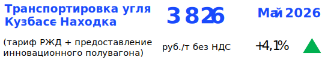

#  Сухопутная логистика. Полувагоны {.my-custom-class style="margin-left:3%;"}

[Демоподписка](../demo-subscription.qmd)

::::::: {.grid style="margin-left:0%"}
::: {.g-col-12 .g-col-sm-12 .g-col-xs-12 .g-col-xl-6 .g-col-md-6 .g-col-lg-6}
### Котировки

*27.02.2026*

**Сибирь и Урал столкнулись с нехваткой порожних полувагонов**

-   Парк полувагонов операторов на инфраструктуре РЖД сократился до 350 тыс. ед.
-   Локальные дефициты полувагонов возниклина полигонах Западно-Сибирской и Свердловской железных дорог: спотовые ставки их предоставления под перевозку угля выросли до 7% м/м.
-   По итогам января экспортные отправки угля в адрес портов Дальнего Востока выросли на 16% г/г до 9,4 млн т при общем снижении экспортной погрузки угля на сети РЖД почти на 13% г/г до 14,1 млн т.

{width="6%"} [Подробнее](../demo-subscription.qmd)

*30.01.2026*

**Снижение грузовой базы усиливает давление на рынок полувагонов**

-   Ставки предоставления полувагонов под перевозку угля снизились в январе в среднем на 5% м/м на фоне падения объёмов среднесуточной погрузки и роста избыточного парка.
-   С 1 янв. 2026 г. отменён понижающий тарифный коэффициент на перевозку минерально-строительных грузов.
-   По итогам 2025 г. парк полувагонов в России вырос на 1%. Отечественные вагоностроительные предприятия выпустили 21,3 тыс. ед. полувагонов (-25% г/г), в т.ч 14,1 тыс. ед. (+17% г/г) – инновационных.

{width="6%"} [Подробнее](../demo-subscription.qmd)

*26.12.2025*

**Повышать ставки нельзя оставить. Где поставить запятую?**

-   Большинству операторов не удалось повысить ставки предоставления полувагонов в декабре несмотря на индексацию железнодорожного тарифа на порожний пробег.
-   Металлические руды - единственные из основных номенклатур грузов, перевозимых в полувагонах, нарастившие погрузку на сети РЖД в 2025 г. относительно 2024 г.
-   Ставки аренды типового полувагона - индекс с худшей динамикой в 2025 г. среди более чем 100 индексов ЦЦИ в железнодорожной и морской логистике: среднегодовое значение снизилось на 47% г/г, а ставки декабря 2025 г. на 74% ниже ставок декабря 2024 г.

{width="6%"} [Подробнее](../demo-subscription.qmd)
:::

::: {.g-col-12 .g-col-sm-12 .g-col-xs-12 .g-col-xl-6 .g-col-md-6 .g-col-lg-6}


### Ставка предоставления полувагона

```{r,warning = FALSE, echo = FALSE, message = FALSE}

library(highcharter)
library(openxlsx)
library(tidyr)

df <- read.xlsx(xlsxFile = '../data/Исходные данные.xlsx', sheet = "Рынки", detectDates = TRUE)
id = "Ставка предоставления полувагона"
df = df[df$Наименование.показателя == id,]
df$Данные <- round(df$Данные,1)
df = df[, c("Дата", "Данные")]
names(df) <- c('dt', 'value')

hc = highchart() %>% 
   hc_add_series(df, type = "line", hcaes(x = dt, y = value), color = "#1A4AFC", name = "Ставка предоставления полувагона", marker = list(enabled = FALSE)) %>% 
   hc_xAxis(type = 'datetime') %>% 
   hc_yAxis(title  = list(text = 'тыс.руб./вагон')) %>% 
   hc_exporting(enabled = FALSE) %>% 
   hc_tooltip(enabled  = TRUE)

# поменять названия месяцев на русские. по умолчанию - на английском
hc$x$conf_opts$lang$months = c("Январь"	,"Февраль",	"Март"	,"Апрель"	,"Май",	"Июнь", "Июль",	"Август",	"Сентябрь",	"Октябрь",	"Ноябрь",	"Декабрь")
hc$x$conf_opts$lang$shortMonths = c("Янв", 	"Фев",	"Мар",	"Апр",	"Май",	"Июн",	"Июл",	"Авг",	"Сен",	"Окт",	"Ноя",	"Дек")

hc
```

[*Примечание: ставка предоставления полувагона рассчитывается как среднее арифметическое между ставками предоставления типового полувагона под перевозку угля по наиболее ликвидным маршрутам экспорта: Кузбасс – порты Дальнего Востока; Кузбасс – порты Балтики; Кузбасс – порты Азово-Черноморского бассейна; Южная Якутия – порты Дальнего Востока. На эти маршруты приходится до 80% экспорта российского угля железнодорожным транспортом. Источник – ежемесячные отчёты ЦЦИ «Сухопутная логистика. Полувагоны». Полный список публикуемых ставок доступен в [Спецификации ставок сухопутной логистики.](../methodology/specs-logistics.qmd)*]{style="font-size:0.75em"}
:::

::: {.g-col-12 .g-col-sm-12 .g-col-xs-12 .g-col-xl-6 .g-col-md-6 .g-col-lg-6}
### События

*6 июня 2025. Пятница с Центром ценовых индексов. Сложное время для рынка угля*

[Материалы →](../events/2025-06-06-coal.qmd)

*7 февраля 2025. Пятница с Центром ценовых индексов. Логистика*

[Материалы →](../events/2025-02-07-logistics.qmd)

*31 мая 2024. Пятница с ЦЦИ: уголь*

[Материалы →](../events/2024-05-31-coal.qmd)
:::

::: {.g-col-12 .g-col-sm-12 .g-col-xs-12 .g-col-xl-4 .g-col-md-6 .g-col-lg-6}
### Методология

[Методология ценовых индикаторов](../methodology/methodology-benchmark-pbc.qmd)

[Спецификация ставок сухопутной логистики](../methodology/specs-logistics.qmd)
:::
:::::::
