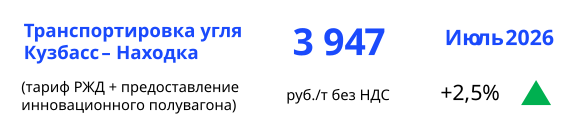

#  Сухопутная логистика. Полувагоны {.my-custom-class style="margin-left:3%;"}

[Демоподписка](../demo-subscription.qmd)

::::::: {.grid style="margin-left:0%"}
::: {.g-col-12 .g-col-sm-12 .g-col-xs-12 .g-col-xl-6 .g-col-md-6 .g-col-lg-6}
### Котировки

*31.07.2026*

**Новые ставки на вагоны - сейчас, новые грузовые тарифы - скоро**

-   Ставки предоставления полувагонов на основных маршрутах экспорта угля выросли в июле на 3-8% м/м.
-   Ставки аренды полувагонов зафиксировались на уровне 0,8 тыс. руб./ваг.-сут. без НДС (23,5 тс) и 1,2 тыс. руб./ваг.-сут. без НДС (25 тс).
-   Утверждена индексация грузового железнодорожного тарифа на 8,5% с 1 октября 2026 г. Это увеличит стоимость транспортировки угля из Кузбасса в порты Дальнего Востока на 309 руб. /т.
-   Темпы роста погрузки угля в июле снизились до 7% г/г против 11% г/г в июне.

{width="6%"} [Подробнее](../demo-subscription.qmd)

*30.06.2026*

**Восстановление ставок на полувагоны продолжается, но замедляется**

-   Ставки предоставления инновационных полувагонов под перевозку угля на маршруте Кузбасс - порты Дальнего Востока выросли в июне на 2% м/м.
-   Погрузка угля на экспорт увеличилась в июне на 20% г/г.
-   Эксплуатационная обстановка на Восточном полигоне остаётся стабильной, при этом существенно осложнилась на южном направлении.
-   Полувагоны перестали быть самым массовым сегментом в структуре производства грузовых вагонов, уступив цистернам. За 5 мес. 2026 г. российские предприятия снизили объёмы выпуска полувагонов на 50% г/г.

{width="6%"} [Подробнее](../demo-subscription.qmd)

*31.05.2026*

**Операторы поднимают ставки вслед за ростом угольных котировок**

-   Ставки предоставления полувагонов под перевозку угля по основным маршрутам экспорта выросли в мае на 2-12% м/м - максимума с июля 2025 г.
-   По итогам апреля экспортная погрузка угля на сети РЖД достигла помесячного максимума за последние 3 года.
-   Средняя расчётная доходность оперирования типовым полувагоном на маршрутах экспорта угля восстановилась в мае до 0,3 тыс. руб./ваг.-сут. (при 100-% порожнем возврате вагона), фактическая достигла 0,8 - 1,0 тыс. руб./ваг.-сут.
-   РЖД утвердили понижающий коэффициент 0,5 к тарифу на перевозки в полувагонах лома чёрных металлов при условии привлечения дополнительных объёмов этого груза.

{width="6%"} [Подробнее](../demo-subscription.qmd)
:::

::: {.g-col-12 .g-col-sm-12 .g-col-xs-12 .g-col-xl-6 .g-col-md-6 .g-col-lg-6}


### Ставка предоставления полувагона

```{r,warning = FALSE, echo = FALSE, message = FALSE}

library(highcharter)
library(openxlsx)
library(tidyr)

df <- read.xlsx(xlsxFile = '../data/Исходные данные.xlsx', sheet = "Рынки", detectDates = TRUE)
id = "Ставка предоставления полувагона"
df = df[df$Наименование.показателя == id,]
df$Данные <- round(df$Данные,1)
df = df[, c("Дата", "Данные")]
names(df) <- c('dt', 'value')

hc = highchart() %>% 
   hc_add_series(df, type = "line", hcaes(x = dt, y = value), color = "#1A4AFC", name = "Ставка предоставления полувагона", marker = list(enabled = FALSE)) %>% 
   hc_xAxis(type = 'datetime') %>% 
   hc_yAxis(title  = list(text = 'тыс.руб./вагон')) %>% 
   hc_exporting(enabled = FALSE) %>% 
   hc_tooltip(enabled  = TRUE)

# поменять названия месяцев на русские. по умолчанию - на английском
hc$x$conf_opts$lang$months = c("Январь"	,"Февраль",	"Март"	,"Апрель"	,"Май",	"Июнь", "Июль",	"Август",	"Сентябрь",	"Октябрь",	"Ноябрь",	"Декабрь")
hc$x$conf_opts$lang$shortMonths = c("Янв", 	"Фев",	"Мар",	"Апр",	"Май",	"Июн",	"Июл",	"Авг",	"Сен",	"Окт",	"Ноя",	"Дек")

hc
```

[*Примечание: ставка предоставления полувагона рассчитывается как среднее арифметическое между ставками предоставления типового полувагона под перевозку угля по наиболее ликвидным маршрутам экспорта: Кузбасс – порты Дальнего Востока; Кузбасс – порты Балтики; Кузбасс – порты Азово-Черноморского бассейна; Южная Якутия – порты Дальнего Востока. На эти маршруты приходится до 80% экспорта российского угля железнодорожным транспортом. Источник – ежемесячные отчёты ЦЦИ «Сухопутная логистика. Полувагоны». Полный список публикуемых ставок доступен в [Спецификации ставок сухопутной логистики.](../methodology/specs-logistics.qmd)*]{style="font-size:0.75em"}
:::

::: {.g-col-12 .g-col-sm-12 .g-col-xs-12 .g-col-xl-6 .g-col-md-6 .g-col-lg-6}
### События

*6 июня 2025. Пятница с Центром ценовых индексов. Сложное время для рынка угля*

[Материалы →](../events/2025-06-06-coal.qmd)

*7 февраля 2025. Пятница с Центром ценовых индексов. Логистика*

[Материалы →](../events/2025-02-07-logistics.qmd)

*31 мая 2024. Пятница с ЦЦИ: уголь*

[Материалы →](../events/2024-05-31-coal.qmd)
:::

::: {.g-col-12 .g-col-sm-12 .g-col-xs-12 .g-col-xl-4 .g-col-md-6 .g-col-lg-6}
### Методология

[Методология ценовых индикаторов](../methodology/methodology-benchmark-pbc.qmd)

[Спецификация ставок сухопутной логистики](../methodology/specs-logistics.qmd)
:::
:::::::
