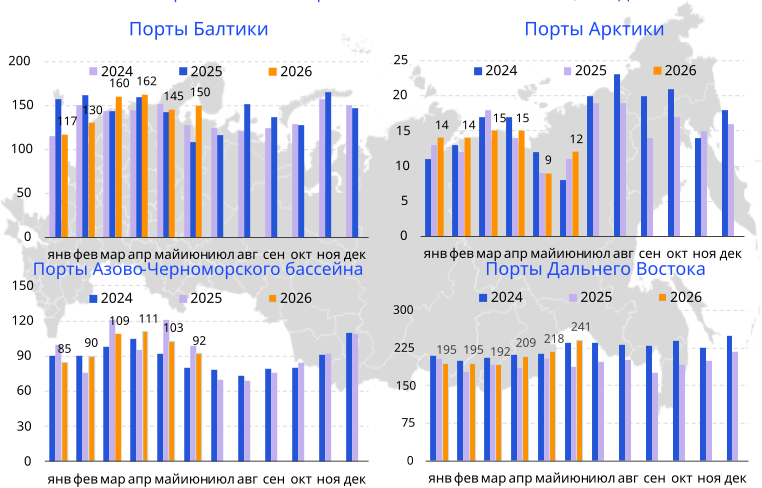

# Перевалка. Контейнеры {.my-custom-class style="margin-left:3%;"}

[Демоподписка](../demo-subscription.qmd)

:::::: {.grid style="margin-left:0%"}
::: {.g-col-12 .g-col-sm-12 .g-col-xs-12 .g-col-xl-6 .g-col-md-6 .g-col-lg-6}
### Котировки

*31.07.2026*

**Импорт дает мощный толчок вверх
ставкам перевалки**

-   Контейнерооборот российских портов за 6 мес. 2026 г. повысился на 2,6% г/г до 2,8 млн ДФЭ. Позитивная динамика перевалки контейнеров в годовом выражении достигнута в Дальневосточном и Арктическом бассейнах, негативная — в Азово-Черноморском и Балтийском.
-   В июне порты Дальнего Востока обновили исторический рекорд по импорту (129,1 тыс. ДФЭ) за счёт роста товарооборота с АТР. Порты Балтики нарастили оборот на фоне переориентации грузов из АЧБ.
-   Тарифы на перевалку гружёных контейнеров в основных портах
показывают разнонаправленную динамику в зависимости от направления отгрузки.

{width="6%"} [Подробнее](../demo-subscription.qmd)

*02.02.2026*

**Российские порты потеряли в контейнерообороте, но не в ставках**

-   Контейнерооборот российских портов за 12 мес. 2025 г. снизился на 4,6 % г/г до 5,3 млн ДФЭ. Позитивная динамика перевалки контейнеров в годовом выражении достигнута в Балтийском и Азово-Черноморском бассейнах, негативная - в Дальневосточном и Арктическом.
-   По итогам 12 мес. 2025 г. Азово-Черноморский бассейн побил исторический рекорд по контейнерообороту.
-   Тарифы на перевалку гружёных контейнеров во всех основных портах выросли за полгода в среднем на 5%, в долларовом эквиваленте рост составил 10%.

{width="6%"} [Подробнее](../demo-subscription.qmd)

*15.08.2025*

**Увеличение ставок перевалки: порты Юга и Балтики в авангарде изменений**

-   Контейнерооборот российских портов за 7 мес. 2025 г. снизился на 2,6% г/г до 3,1 млн ДФЭ. Позитивная динамика перевалки контейнеров в годовом выражении достигнута в Балтийском и Азово-Черноморском бассейнах, негативная — в Дальневосточном и Арктическом.
-   По итогам 7 мес. 2025 г. Большой порт Санкт-Петербург и Владивосток сравнялись по объёмам перевалки контейнеров.
-   За последние полгода российские терминалы проиндексировали тарифы на перевалку гружёных контейнеров в среднем на 6% (в рублях), при этом рост тарифов в долларовом эквиваленте составил в среднем 20-30%.

{width="6%"} [Подробнее](../demo-subscription.qmd)
:::

::: {.g-col-12 .g-col-sm-12 .g-col-xs-12 .g-col-xl-6 .g-col-md-6 .g-col-lg-6}
### Объём перевалки контейнеров по бассейнам за 6 мес. 2026 г., тыс. ДФЭ

{width="100%"}
:::

::: {.g-col-12 .g-col-sm-12 .g-col-xs-12 .g-col-xl-6 .g-col-md-6 .g-col-lg-6}
### Методология

[Методология ценовых индикаторов](../methodology/methodology-benchmark-pbc.qmd)

[Спецификация ставок перевалки](../methodology/specs-ports.qmd)
:::
::::::
