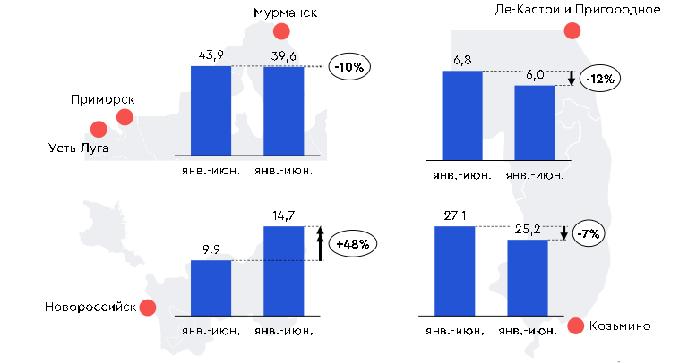

#  Перевалка. Нефть {.my-custom-class style="margin-left:3%;"}

[Демоподписка](../demo-subscription.qmd)

:::::: {.grid style="margin-left:0%"}
::: {.g-col-12 .g-col-sm-12 .g-col-xs-12 .g-col-xl-6 .g-col-md-6 .g-col-lg-6}
### Котировки

*27.08.2026*

**Порты Северо-Запада - цитадель стабильности**

-   Снижение поставок российской нефти на мировые рынки привели к уменьшению тарифов перевалки в основных экспортных портах.

-   Рост отгрузок из Мурманска и Усть-Луги компенсирует снижение торговой активности в АЧБ.

-   Увеличение стоимости нефти в период Ормузского кризиса обусловило охлаждение спроса потребителей из КНР и снижение объемов перевалки нефти из восточных портов РФ.

{width="6%"} [Подробнее](../demo-subscription.qmd)

*12.02.2026*

**Ставки перевалки нефти увеличились вопреки снижению экспорта**

-   Объём экспортной перевалки в 2 пол. 2025 г. снизился на 3% пол./пол., что обусловлено новыми вызовами, направленными на внешнеторговую деятельность РФ.

-   Ставки перевалки нефти выросли во всех экспортных портах.

-   Козьмино остался главным портом по экспорту российской нефти несмотря на снижение объёмов перевалки на 7% пол./пол.

{width="6%"} [Подробнее](../demo-subscription.qmd)

*08.08.2025*

**Тарифы на перевалку не спешат расти**

-   Объем экспортной перевалки в 1 пол. 2025 г. снизился на 4,4% пол./пол., что обусловлено новыми ограничениями на российскую нефтяную отрасль.

-   Ставки на перевалку российской нефти в портах АЧБ остались без изменений, в портах Балтики – показали незначительное снижение.

{width="6%"} [Подробнее](../demo-subscription.qmd)
:::

::: {.g-col-12 .g-col-sm-12 .g-col-xs-12 .g-col-xl-6 .g-col-md-6 .g-col-lg-6}
### Объём экспортной перевалки российской нефти в основных портах, млн т

{width="100%"}

### Аналитика

*27 октября 2024. Что такое цена на нефть?*

[Материалы →](../events/2024-10-27-crude.qmd)

### События

*7 февраля 2025. Пятница с Центром ценовых индексов. Логистика*

[Материалы →](../events/2025-02-07-logistics.qmd)

*13 сентября 2024. Пятница с ЦЦИ: корабли с черным золотом*

[Материалы →](../events/2024-09-13-crude.qmd)
:::

::: {.g-col-12 .g-col-sm-12 .g-col-xs-12 .g-col-xl-6 .g-col-md-6 .g-col-lg-6}
### Методология

[Методология ценовых индикаторов](../methodology/methodology-benchmark-pbc.qmd)

[Спецификация ставок перевалки](../methodology/specs-ports.qmd)
:::
::::::
