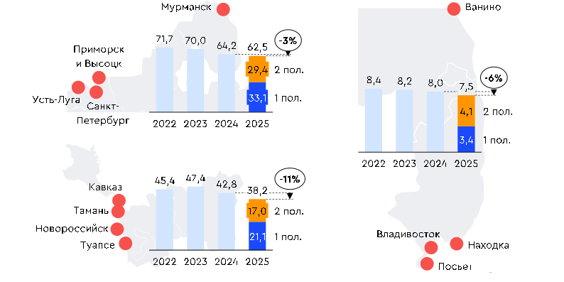

#  Перевалка. Нефтепродукты {.my-custom-class style="margin-left:3%;"}

[Демоподписка](../demo-subscription.qmd)

:::::: {.grid style="margin-left:0%"}
::: {.g-col-12 .g-col-sm-12 .g-col-xs-12 .g-col-xl-6 .g-col-md-6 .g-col-lg-6}
### Котировки

*27.08.2026*

**Рост тарифов в Высоцке выбился из общего тренда**

-   Падение объемов экспортной перевалки нефтепродуктов до 48,2 млн т (-5,5% пол./пол.) привело к снижению тарифов во всех основных портах РФ.

-   Ажиотажный спрос, превышающий экспортные возможности порта Высоцк, привел к росту тарифов на перевалку светлых нефтепродуктов на 98% пол. /пол.

-   Объем отгрузок из Мурманска и Тамани увеличился на 348% и 355% пол. /пол. соответственно.

{width="6%"} [Подробнее](../demo-subscription.qmd)

*12.02.2026*

**Тарифы выросли несмотря на снижение экспорта**

-   Тарифы на перевалку нефтепродуктов выросли во всех основных портах России на фоне падения объёмов морских отгрузок на 12% пол./пол. Наиболее заметный рост тарифов по светлым нефтепродуктам отмечается в порту Находка (+14,1% пол./пол.), по тёмным - в порту Ванино (+16,7% пол./пол.).

-   Ставки перевалки в порту Тамань упали в среднем на 12% пол./пол.

-   Увеличение объёмов перевалки в Дальневосточных портах на 21% пол./пол. сдержало рост ставок в порту Владивосток.

{width="6%"} [Подробнее](../demo-subscription.qmd)

*08.08.2025*

**Падение экспорта в Черном море тянет ставки перевалки за собой**

-   Тарифы на перевалку российских нефтепродуктов в 1 пол. 2025 г. заметнее всего увеличились в портах Дальнего Востока. Диапазон роста для светлых нефтепродуктов составляет от 16 19% пол./пол., для темных нефтепродуктов – верхняя граница составляет 12% пол./пол.

-   Снижение отгрузок нефтепродуктов в портах АЧБ на 11% пол./пол. обусловило падение стоимости перевалки в порту Тамань 8,4% пол./пол. для всех видов нефтепродуктов.

-   Экспортная перевалка российских нефтепродуктов в портах в 1 пол. 2025 г. выросла на 11% (пол./пол.).

{width="6%"} [Подробнее](../demo-subscription.qmd)
:::

::: {.g-col-12 .g-col-sm-12 .g-col-xs-12 .g-col-xl-6 .g-col-md-6 .g-col-lg-6}
### Объём экспортной перевалки российских нефтепродуктов в основных портах, млн т

{width="100%"}

### Аналитика

*27 октября 2024. Что такое цена на нефть?*

[Материалы →](../events/2024-10-27-crude.qmd)

### События

*7 февраля 2025. Пятница с Центром ценовых индексов. Логистика*

[Материалы →](../events/2025-02-07-logistics.qmd)

*13 сентября 2024. Пятница с ЦЦИ: корабли с черным золотом*

[Материалы →](../events/2024-09-13-crude.qmd)
:::

::: {.g-col-12 .g-col-sm-12 .g-col-xs-12 .g-col-xl-6 .g-col-md-6 .g-col-lg-6}
### Методология

[Методология ценовых индикаторов](../methodology/methodology-benchmark-pbc.qmd)

[Спецификация ставок перевалки](../methodology/specs-ports.qmd)
:::
::::::
